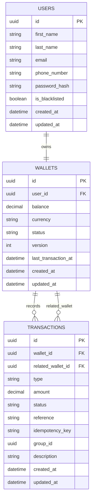

# Lending Wallet API

Backend API for the Lendsqr wallet assessment, built with `Node.js`, `TypeScript`, `NestJS`, `Knex`, and `MySQL`.

## Project Summary

This project implements the core MVP for a lending wallet service:

- user registration
- onboarding blacklist check
- wallet auto-creation
- wallet funding
- wallet withdrawal
- wallet-to-wallet transfer

The goal of the implementation is not only to make endpoints work, but to keep money movement safe, testable, and easy to review.

## Implemented MVP Features

- User onboarding via `POST /auth/register`
- Blacklist check during onboarding using Karma / Adjutor integration
- Wallet auto-creation on signup
- Fund wallet via `POST /wallets/fund`
- Withdraw wallet via `POST /wallets/withdraw`
- Transfer funds via `POST /wallets/transfer`
- Login via `POST /auth/login`
- Get authenticated user profile via `GET /users/me`

## Tech Stack

- `Node.js(NestJS)`
- `TypeScript`
- `Knex`
- `MySQL`
- `Jest`
- `Swagger`

## Deployment

The API is deployed on [Railway](https://railway.app/) using the **free tier**. The database is **Railway MySQL** (Railway’s managed MySQL). Use the MySQL service connection URL from the Railway dashboard as `MYSQL_URL` in your service variables.

## Implementation Approach

The implementation is structured as a service-oriented NestJS API with clear boundaries between transport, business logic, and persistence concerns.

High-level flow:

1. A client sends a request to a controller endpoint.
2. DTO validation checks the request shape and basic constraints.
3. The controller extracts the authenticated user context where needed.
4. A service executes the business rules for the use case.
5. For money movement, database writes are wrapped in a single transaction.
6. Ledger records are written alongside balance updates so that wallet history remains traceable.

For onboarding, the application checks the blacklist provider before creating the user record. If the user is eligible, the service creates both the user and wallet as part of the onboarding flow.

For wallet operations, the application validates the amount, locks the relevant wallet row or rows, applies balance changes, inserts transaction records, and commits atomically.

## Architecture Decisions And Rationale

### Nodejs (NestJS)for API structure

`NestJS` was chosen to provide a modular backend structure, dependency injection, DTO validation, and a clean controller/service/provider split. This makes the project easier to extend and easier for reviewers to reason about.

### Knex for SQL control

`Knex` was chosen instead of a heavier ORM to keep SQL access explicit. This is useful for wallet operations where transaction control, row locking, and clear database behavior matter more than ORM abstraction.

### MySQL as required relational store

`MySQL` satisfies the assessment requirement and fits the transactional nature of wallet balances and ledger history.

### JWT bearer-token authentication

The API uses `@nestjs/jwt` for access tokens. Tokens are verified with the configured secret, issuer, and audience before any protected handler runs. See **Security overview** below for how guards, public routes, and per-route auth metadata work together.

### Ledger-based wallet updates

Instead of only mutating wallet balances, each money movement also creates a transaction record. This improves traceability and makes audits and debugging easier.

### Transaction scoping for money movement

Fund, withdraw, and transfer operations are wrapped in database transactions. This prevents partial writes, especially in cases where a balance update succeeds but transaction insert fails, or vice versa.

### Row locking for concurrency safety

Wallet rows are locked with `FOR UPDATE` during mutable operations. This reduces the risk of race conditions and lost updates when concurrent requests target the same wallet.

### Shared transfer group id

Transfers write two ledger rows, one for debit and one for credit, linked by a shared `group_id`. This makes paired transfer records easy to reconcile.

## Security overview

This section summarizes how the API protects onboarding, authentication, and money movement. It matches what the code does today (guards, hashing, Karma lookup, validation, locks, and idempotency).

### Authentication and route protection

- **Global guard:** `AuthenticationGuard` is registered as `APP_GUARD`, so every route requires authentication **unless** it is explicitly opened.
- **Public routes:** Handlers marked with `@Public()` skip authentication (for example root liveness and database health checks on `AppController`).
- **Register and login:** `POST /auth/register` and `POST /auth/login` use `@Auth(AuthType.None)` so new users can sign up and existing users can log in without a token.
- **Everything else:** Protected handlers use `@Auth(AuthType.Bearer)` (or rely on the default bearer requirement). The access-token guard reads `Authorization: Bearer <token>`, verifies the JWT, and attaches the payload to the request.
- **Who is the caller:** Wallet and profile code uses `@GetUserId()` so operations always run as the user encoded in the token (`sub`), not as an arbitrary id from the body.

### Passwords (never stored in plain text)

- On register, passwords are hashed with **bcrypt** (per-password salt) before persisting `password_hash`.
- On login, the submitted password is compared to the stored hash with bcrypt’s constant-time compare. Plain passwords are not written to the database or logs by design of this flow.

### Onboarding and Karma (blacklist) identity

- Before creating a user, the service checks **Adjutor Karma** using the registrant’s **email**.
- The email is **normalized** (trimmed and lowercased) for consistent lookups.
- When building the HTTP path to Karma, the identity segment is passed through `**encodeURIComponent`**, so characters that mean something in URLs (`@`, `+`, `%`, and so on) are safe and the provider receives the exact string you intended.

### Request validation (shape and unknown fields)

- A global `**ValidationPipe`** strips properties that are not on the DTO (`whitelist: true`), rejects requests with extra properties (`forbidNonWhitelisted: true`), and coerces types where appropriate (`transform: true`). That reduces “surprise” fields and basic injection of unexpected payloads.

### Money movement: transactions, locks, and business rules

- **Single database transaction:** Fund, withdraw, and transfer logic runs inside one Knex transaction so balance updates and ledger rows commit or roll back together.
- **Row locking:** Wallet rows are selected with `**FOR UPDATE`** inside that transaction before balances change. That limits lost updates and race conditions when two requests touch the same wallet.
- **Transfer locking order:** Transfers lock the sender’s wallet first, then the recipient’s. Under very high concurrency, cross transfers could still theoretically contend; see limitations below.
- **Rules enforced on the locked row:** Active wallet only, valid amounts, sufficient balance for withdraw/transfer, and **no self-transfer**.
- **Ledger:** Each movement creates transaction rows with a unique `**reference`** (`randomUUID()`). Transfers use a shared `**group_id`** so debit and credit pair cleanly.

### Idempotency (retry-safe wallet mutations)

- **Client header:** `POST /wallets/fund`, `POST /wallets/withdraw`, and `POST /wallets/transfer` require an `**Idempotency-Key`** header (non-empty after trim). Missing or blank keys are rejected.
- **Server behavior:** The same key for the same wallet and operation type **replays the prior outcome** instead of performing the movement again. Keys are stored on ledger rows; the database enforces uniqueness on `(wallet_id, type, idempotency_key)`.
- **Transfers:** Idempotency is applied to the **transfer-out** leg first; a replay returns the same paired references as the original transfer.

### Configuration and secrets

- Environment variables are validated at startup (Joi), including database URL, JWT settings, and Karma (Adjutor) credentials, so the app fails fast if secrets or URLs are missing.

### Quick reference checklist


| Concern            | What we do                                                         |
| ------------------ | ------------------------------------------------------------------ |
| Default for routes | Authenticate unless `@Public()` or `@Auth(None)`                   |
| JWT                | Verify secret, issuer, audience; bearer header only                |
| Passwords          | Bcrypt hash + compare                                              |
| Karma email in URL | Normalize email, then `encodeURIComponent` in path                 |
| Input              | DTO validation + whitelist / forbid extra fields                   |
| Concurrency        | `FOR UPDATE` on wallets inside DB transactions                     |
| Retries            | `Idempotency-Key` on all wallet mutations                          |
| Integrity          | Atomic transactions; unique references; paired transfer `group_id` |


## API Endpoints

### Auth

- `POST /auth/register`
- `POST /auth/login`

### Users

- `GET /users/me`

### Wallets

- `POST /wallets/fund`
- `POST /wallets/withdraw`
- `POST /wallets/transfer`

## Transaction Strategy

For each mutable wallet operation:

1. Open one database transaction.
2. Lock the required wallet rows using `FOR UPDATE`.
3. Validate business rules against the locked state.
4. Update wallet balances.
5. Insert corresponding ledger transaction row or rows.
6. Commit atomically, or roll back on failure.

This approach prevents partial money movement and improves consistency under concurrent access.

## ER Diagram




## Testing Strategy

The project includes both unit and end-to-end testing.

- Unit tests cover wallet service behavior and controller response envelopes.
- Positive and negative scenarios are included for fund, withdraw, and transfer flows.
- End-to-end tests validate registration, login, funding, withdrawal, and transfer against the running application and database.

## API Testing Helpers

- Wallet request samples: `src/https/wallets.http`
- Auth request samples: `src/https/auth.http`

## Supporting Assessment Notes

- `src/docs/wallet-fund-checklist.md`
- `src/docs/wallet-withdraw-checklist.md`
- `src/docs/wallet-transfer-checklist.md`
- `src/docs/assessment-understanding.md`

## Project Setup

```bash
npm install
```

## Environment Setup

Create the required environment variables for:

- `MYSQL_URL` (locally or on Railway: use the connection string from your Railway MySQL plugin/service)
- `JWT_SECRET`
- `JWT_TOKEN_AUDIENCE`
- `JWT_TOKEN_ISSUER`
- `JWT_ACCESS_TOKEN_TTL`
- `JWT_REFRESH_TOKEN_TTL`
- `KARMA_PROVIDER`
- `KARMA_BASE_URL`
- `KARMA_APP_ID`
- `KARMA_API_KEY`

## Run The Project

```bash
npm run start:dev
```

## Run Tests

```bash
npm test
npm run test:e2e
```

Wallet-focused tests can also be run with:

```bash
npm test -- wallets.service.spec.ts wallets.controller.spec.ts
```

## Assumptions

- Wallets are automatically created when a user signs up.
- The blacklist lookup is performed using the user email.
- Amount precision is limited to two decimal places.
- JWT bearer-token authentication is sufficient for the scope of this assessment.
- Onboarding uses Adjutor Karma to determine blacklist eligibility.

