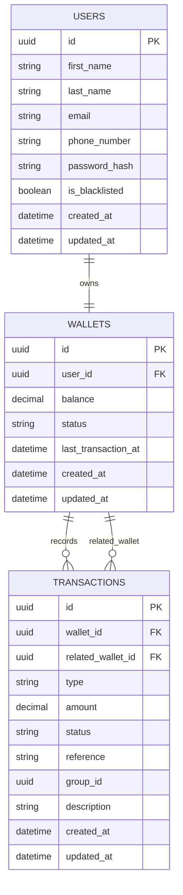

# Lending Wallet API

Backend API for the Lendsqr wallet assessment, built with `Node.js`, `TypeScript`, `NestJS`, `Knex`, and `MySQL`.

## Project Summary

This project implements the core MVP for a lending wallet service:

- user registration
- onboarding blacklist check
- wallet auto-creation
- wallet funding
- wallet withdrawal
- wallet-to-wallet transfer

The goal of the implementation is not only to make endpoints work, but to keep money movement safe, testable, and easy to review.

## Assessment Deliverables

- Deployment URL: `TODO_ADD_DEPLOYMENT_URL`
- GitHub repository URL: `TODO_ADD_REPOSITORY_URL`
- Public review document: `TODO_ADD_PUBLIC_REVIEW_DOC_URL`
- Loom video URL: `TODO_ADD_LOOM_VIDEO_URL`

Replace the placeholders above before submission.

## Implemented MVP Features

- User onboarding via `POST /auth/register`
- Blacklist check during onboarding using Karma / Adjutor integration
- Wallet auto-creation on signup
- Fund wallet via `POST /wallets/fund`
- Withdraw wallet via `POST /wallets/withdraw`
- Transfer funds via `POST /wallets/transfer`
- Login via `POST /auth/login`
- Get authenticated user profile via `GET /users/me`

## Tech Stack

- `Node.js`
- `TypeScript`
- `NestJS`
- `Knex`
- `MySQL`
- `Jest`
- `Swagger`

## Implementation Approach

The implementation is structured as a service-oriented NestJS API with clear boundaries between transport, business logic, and persistence concerns.

High-level flow:

1. A client sends a request to a controller endpoint.
2. DTO validation checks the request shape and basic constraints.
3. The controller extracts the authenticated user context where needed.
4. A service executes the business rules for the use case.
5. For money movement, database writes are wrapped in a single transaction.
6. Ledger records are written alongside balance updates so that wallet history remains traceable.

For onboarding, the application checks the blacklist provider before creating the user record. If the user is eligible, the service creates both the user and wallet as part of the onboarding flow.

For wallet operations, the application validates the amount, locks the relevant wallet row or rows, applies balance changes, inserts transaction records, and commits atomically.

## Architecture Decisions And Rationale

### NestJS for API structure

`NestJS` was chosen to provide a modular backend structure, dependency injection, DTO validation, and a clean controller/service/provider split. This makes the project easier to extend and easier for reviewers to reason about.

### Knex for SQL control

`Knex` was chosen instead of a heavier ORM to keep SQL access explicit. This is useful for wallet operations where transaction control, row locking, and clear database behavior matter more than ORM abstraction.

### MySQL as required relational store

`MySQL` satisfies the assessment requirement and fits the transactional nature of wallet balances and ledger history.

### JWT bearer-token authentication

The API uses `@nestjs/jwt` to issue signed access tokens during registration and login. Each token carries the authenticated user identity in its payload, primarily `sub` as the user ID and `email`. Protected routes use a custom bearer-token guard to read the `Authorization: Bearer <token>` header, verify the JWT with the configured secret, issuer, and audience, and attach the decoded payload to the request. Controllers then access the authenticated user through `@GetUserId()`, which keeps wallet operations scoped to the current user without introducing a full session-based or OAuth-based authentication platform.

### Ledger-based wallet updates

Instead of only mutating wallet balances, each money movement also creates a transaction record. This improves traceability and makes audits and debugging easier.

### Transaction scoping for money movement

Fund, withdraw, and transfer operations are wrapped in database transactions. This prevents partial writes, especially in cases where a balance update succeeds but transaction insert fails, or vice versa.

### Row locking for concurrency safety

Wallet rows are locked with `FOR UPDATE` during mutable operations. This reduces the risk of race conditions and lost updates when concurrent requests target the same wallet.

### Shared transfer group id

Transfers write two ledger rows, one for debit and one for credit, linked by a shared `group_id`. This makes paired transfer records easy to reconcile.

## Security And Money-Movement Controls

- Bearer-auth protected wallet mutation routes
- User-scoped wallet access via token claims through `@GetUserId()`
- DTO validation with `class-validator`
- Service-level defensive amount validation
- Wallet status enforcement for mutable operations
- Sufficient balance checks for withdraw and transfer
- Self-transfer prevention
- Unique transaction references via `randomUUID()`
- Idempotent wallet mutations through required `Idempotency-Key` header
- Database transaction scoping for wallet mutations
- Row-level locking with `FOR UPDATE`

## API Endpoints

### Auth

- `POST /auth/register`
- `POST /auth/login`

### Users

- `GET /users/me`

### Wallets

- `POST /wallets/fund`
- `POST /wallets/withdraw`
- `POST /wallets/transfer`

## Transaction Strategy

For each mutable wallet operation:

1. Open one database transaction.
2. Lock the required wallet rows using `FOR UPDATE`.
3. Validate business rules against the locked state.
4. Update wallet balances.
5. Insert corresponding ledger transaction row or rows.
6. Commit atomically, or roll back on failure.

This approach prevents partial money movement and improves consistency under concurrent access.

## ER Diagram




## Testing Strategy

The project includes both unit and end-to-end testing.

- Unit tests cover wallet service behavior and controller response envelopes.
- Positive and negative scenarios are included for fund, withdraw, and transfer flows.
- End-to-end tests validate registration, login, funding, withdrawal, and transfer against the running application and database.

## API Testing Helpers

- Wallet request samples: `src/https/wallets.http`
- Auth request samples: `src/https/auth.http`

## Supporting Assessment Notes

- `src/docs/wallet-fund-checklist.md`
- `src/docs/wallet-withdraw-checklist.md`
- `src/docs/wallet-transfer-checklist.md`
- `src/docs/assessment-understanding.md`

## Project Setup

```bash
npm install
```

## Environment Setup

Create the required environment variables for:

- `MYSQL_URL`
- `JWT_SECRET`
- `JWT_TOKEN_AUDIENCE`
- `JWT_TOKEN_ISSUER`
- `JWT_ACCESS_TOKEN_TTL`
- `JWT_REFRESH_TOKEN_TTL`
- `KARMA_PROVIDER`
- `KARMA_BASE_URL`
- `KARMA_APP_ID`
- `KARMA_API_KEY`

## Run The Project

```bash
npm run start:dev
```

## Run Tests

```bash
npm test
npm run test:e2e
```

Wallet-focused tests can also be run with:

```bash
npm test -- wallets.service.spec.ts wallets.controller.spec.ts
```

## Assumptions

- Wallets are automatically created when a user signs up.
- The blacklist lookup is performed using the user email.
- Amount precision is limited to two decimal places.
- JWT bearer-token authentication is sufficient for the scope of this assessment.
- Onboarding uses Adjutor Karma to determine blacklist eligibility.

## Karma Identity Encoding Note

Adjutor Karma identity checks use the identity in the URL path segment. Because emails may contain URL-reserved characters (for example `+`, `@`, `%`, `/`, `?`, `#`), the identity is URL-encoded before sending the request. This ensures the server receives the exact email value as one safe path segment.

Example:

- Raw: `john+test@gmail.com`
- Safe in path: `john%2Btest%40gmail.com`

If encoding is skipped, the provider can parse the identity incorrectly, which may lead to wrong lookup results or `4xx` responses.

## Known Limitations / Future Improvements

- Transfer lock ordering can be improved further to reduce deadlock risk under very high contention.
- A full production authentication and authorization model is outside the current assessment scope.
- README placeholders still need actual submission links before final delivery.

